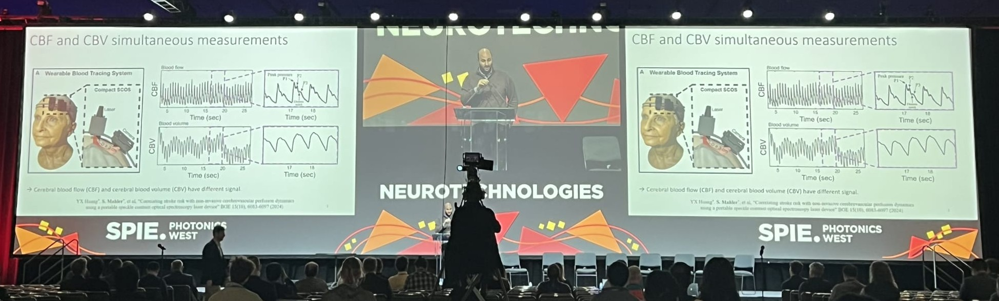

I am Simon Mahler (Marseille, France), assistant professor in the <a href="https://www.stevens.edu/profile/smahler" target="_blank">Department of Biomedical Engineering</a>, Stevens Institute of Technology (New Jersey, USA). Before that, I was a postdoctoral scholar research associate at California Institute of Technology (Caltech, 2021-2025),  <a href="https://biophot.caltech.edu/" target="_blank">Biophotonics Lab</a> of Professor Changhuei Yang. I did my PhD (2017-2021) at the Weizmann Institute of Science, in the <a href="https://www.weizmann.ac.il/complex/NirDavidson/research-activities/coupled-lasers" target="_blank">Coupled Lasers Lab</a> of Professors Nir Davidson and Asher A. Friesem. I obtained my Master (2015-2017) in <a href="https://physics-complex-systems.fr/en/" target="_blank">Physics of Complex System </a> from the Univeristy Paris-Sud (Paris-Saclay). 

My speckle imaging lab at Stevens concentrates on the intersection of bio-imaging and optics, with focus on how light interacts with biological samples (biophotonics) and interests in engineering, device design, the integration of artificial intelligence, the development of novel light sources, and translational research. Our goal is to develop innovative imaging techniques to visualize dynamic biological processes, such as blood dynamics with applications ranging from neurological diseases to embryonic development. For that, we are using laser speckle imaging. 

If you are interested in further details of any of my work or just want to connect, feel free to contact me!

News
======

<u>January 2026</u>: I had a great time attending <strong>SPIE Photonics West 2026</strong> international conference in optics and photonics. The Biomedical Optics (BIOS) symposium continues to be an incredible forum for sharing the most recent research, inspiring discussions, and welcoming connections/collaborations. I was honored to deliver a large talk in the <strong>Neurotechnologies</strong> plenary session, where I presented our latest work on advanced optical methods for brain imaging. 
  
👉 <a href="https://www.linkedin.com/posts/spie_neurophotonics-photonicswest-activity-7418889971337646081-kqsf?utm_source=share&utm_medium=member_desktop&rcm=ACoAABuqUTEBgjKSbzdXou7dlfHxv6CuI2Gma2w" target="_blank">
        LinkedIn Post – SPIE Neurotechnologies at Photonics West</a>
    

    

<u>August 2025</u>: I am now at Stevens Institute of Technology campus. My labs are located on room 304 and 305 of the McLean Hall.

<u>March 2025</u>: I am happy to share that I will be joining in Sep-25 the <a href="https://www.stevens.edu/school-engineering-science/departments/biomedical-engineering" target="_blank">Department of Biomedical Engineering</a>, Stevens Institute of Technology (New Jersey) as a tenure-track Assistant Professor 🎉! My future lab will be exploring bio-imaging and optics (biophotonics)—with a focus on laser speckle imaging for blood flow in living tissues, advancing applications in neurological disease detection and cardiac embryonic development. If you're curious about my future work, interested in joining the lab, want to collaborate, or just want to connect, feel free to reach out!🚀

<u>February 2025</u>: I am happy to share our recent publication in <a href="https://doi.org/10.1117/1.NPh.12.1.015003" target="_blank">NeuroPhotonics</a> about a portable six-channel laser speckle system for measuring brain blood flow and volume simultaneously. Don't hesitate to reach out to me if you want to connect, have a question, or have a comment! 
 
<u>November 2024</u>: I’m seeking a new role. If you hear any opportunities or want to catch up, please connect with me!
 💼 I’m looking for Assistant Professor, Tenure-track and Academic Researcher roles.
 🌎 I’m open to roles in United States, Canada, France, Schengen Area, European Union and more.

Disclosure
------
This website was generated using Academic_Pages template in Github. The template can be found at <a href="https://academicpages.github.io" target="_blank">academicpages.github.io</a>. I thank Academic_Pages for the opportuinity of using their template.
