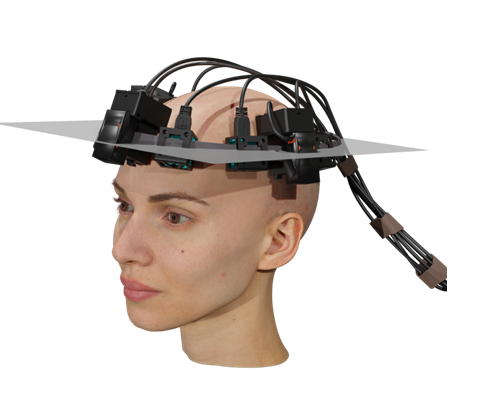
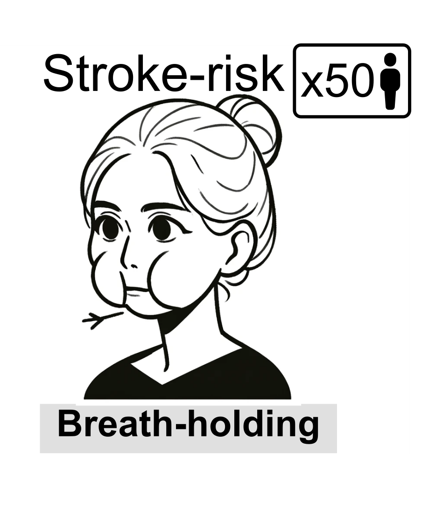
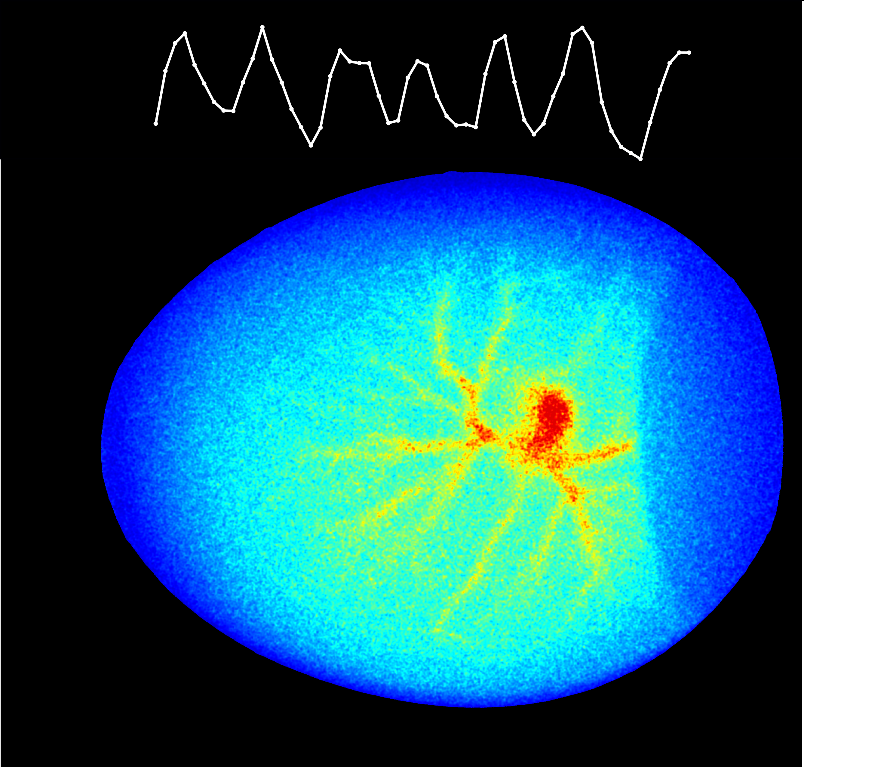
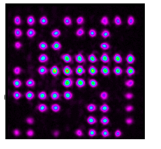


 
You can also find my articles on <a href="{{site.author.googlescholar}}" target="_blank">my Google Scholar profile</a>.


## List of Publications 
#### Sorted from most recent to oldest
 29 – <b>Optimized cerebral blood flow measurement in speckle contrast optical spectroscopy via refinement of noise calibration.</b>   N. Liu, Y.X. Huang, S. Mahler, C. Yang.     Under review (2025). <a href="https://arxiv.org/abs/2506.15843" target="_blank">(article link)</a>   

 28 – <b>Exploring Non-Invasive Sexing of Chicken Eggs at the Early Embryonic Stage Using Laser Speckle Contrast Imaging and Deep Neural Networks.</b>   S. Mahler,  Z. Dong, C. Redhead, M. Bronner, C. Yang.     bioRXiv:2025.04.17.649355 Under review (2025). <a href="https://www.biorxiv.org/content/10.1101/2025.04.17.649355v1" target="_blank">(article link)</a>    

  27 – <b>Assessing Scalp and Brain Sensitivity in Blood Flow Measurements via Occlusion of the Temporal Artery.</b>   Y. X. Huang*, S. Mahler,  M. Dickson, A. Abedi, J. M. Tyszka, J. L. Y. Tung, J. Russin, C. Liu, C. Yang.    arXiv:2501.19005 Under review (2025). <a href="https://doi.org/10.48550/arXiv.2501.19005" target="_blank">(article link)</a>    

  26 – <b>Portable Six-Channel Laser 
Speckle System for Cerebral Blood Flow and Volume Measurements with Potential Application in Traumatic Brain Injury Detection.</b>  S. Mahler,  Y. X. Huang, M. Ismagilov, D.A. Chou, A. Abedi, J. M. Tyszka, J. L. Y. Tung, J. Russin, C. Liu, C. Yang.    Neurophotonics 12(1), 015003 (2025). <a href="https://doi.org/10.1117/1.NPh.12.1.015003" target="_blank">(article link)</a>    

  25 – <b>Automated Non-Invasive Laser 
Speckle Imaging of the Chick Heart Rate and Extraembryonic Blood Vessels and Their Response to Nifedipine and Amlodipine Drugs.</b>    C. Redhead*, S. Mahler*,  Z. Dong, X. Chen, C. Yang, M. E. Bronner.    Developmental Biology 519, 46-54 (2025). <a href="https://doi.org/10.1016/j.ydbio.2024.12.005" target="_blank">(article link)</a>    

   24 – <b>Roadmap on Structured Light Lasers.</b>    Q. Liu, X. Fu, Z. Zhang, A. Forbes, N. Davidson, S. Mahler,  A. Friesem et al.    Under peer-review, Journal of Optics (2024).    

   23 – <b>[Editors' Pick + News Release] Correlating Stroke Risk with Non-Invasive Cerebrovascular Perfusion Dynamics Using a Portable Speckle Contrast Optical Spectroscopy Laser Device.</b>   Y.X. Huang*,S. Mahler*,  A. Abedi, J.M. Tyszka, J.L.Y. Tung, P. Lyden, J. Russin, C. Liu, C. Yang.    Biomedical Optics Express 15, 6083-6097 (2024). <a href="https://doi.org/10.1364/BOE.534796" target="_blank">(article link)</a>    

  22 – <b>[Editors' Pick – Journal Cover] Non-Invasive Laser Speckle Contrast Imaging (LSCI) of Extra-Embryonic Blood Vessels in Intact Avian Eggs at Early Developmental Stages.</b>   Z. Dong*, S. Mahler*,  C. Redhead, X. Chen, M. Dickson, M. Bronner, C. Yang.  Biomedical Optics Express 15(8), 4605-4624 (2024). <a href="https://doi.org/10.1364/BOE.530366" target="_blank">(article link)</a>    

  21 – <b>Compact and Cost-Effective Laser-Powered Speckle Contrast Optical Spectroscopy Fiber-Free Device for Measuring Cerebral Blood Flow.</b>   Y. X. Huang*, S. Mahler*,  M. Dickson, A. Abedi, J. M. Tyszka, J. L. Y. Tung, J. Russin, C. Liu, C. Yang.    Journal of Biomedical Optics 29(6), 067001 (2024). <a href="https://doi.org/10.1117/1.jbo.29.6.067001" target="_blank">(article link)</a>    

  20 – <b>AI-Guided Histopathology Predicts Brain Metastasis in Lung Cancer Patients.</b>    H. Zhou, M. Watson, C. T. Bernadt, S. S. Lin, C. Lin, J. H. Ritter, A. Wein,  S. Mahler,  S. Rawal, R. Govindan, C. Yang, R. Cote.    Journal of Pathology 263, 89-98 (2023). <a href="https://doi.org/10.1002/path.6263" target="_blank">(article link)</a>    

  19 – <b>[Editors' Pick] Assessing 
Depth Sensitivity in Laser Interferometry Speckle Visibility Spectroscopy (iSVS) Through Source-to-Detector Distance Variation and Cerebral Blood Flow Monitoring in Humans and Rabbits.</b> S. Mahler,  Y.X. Huang, M. Liang, A. Avalos, J.M. Tyszka, J. Mertz, C. Yang.    Biomedical Optics Express 14, 4964-4978 (2023). <a href="https://doi.org/10.1364/BOE.498815" target="_blank">(article link)</a>    

  18 – <b>Interferometric Speckle Visibility Spectroscopy (iSVS) for Measuring Decorrelation Time and Dynamics of Moving Samples with Enhanced Signal-to-Noise Ratio and Relaxed Reference Requirements.</b>    Y. X. Huang, S. Mahler,  J. Mertz, C. Yang.    Optics Express 31(19), 31253-31266 (2023). <a href="https://doi.org/10.1364/OE.499473" target="_blank">(article link)</a>    

  17 – <b> Percolation with coupled lasers: effect of non-linearities on the phase transition. </b>   S. Mahler,   M. A. Rmilah, A. A. Friesem, N. Davidson.     Under preparation, (2024). <a href="https://doi.org/10.1364/OE.499473" target="_blank">(article link)</a>     

   16 – <b> Programmable all optical spin simulator with artificial gauge fields. </b>   S. Mahler*,  E. Bernstein*, S. Gadasi, G. Arwas, A. A. Friesem, N. Davidson.     Second round of peer-review, Physical Review Letters (2024). <a href="https://arxiv.org/abs/2408.13865" target="_blank">(article link)</a>   

   15 – <b>Complex-Light Lasers.</b>  N. Davidson, S. Mahler,  A. A. Friesem, A. Forbes.  Optics and Photonics News May 2022, 26–33 (2022). <a href="https://doi.org/10.1364/OPN.33.5.000026" target="_blank">(article link)</a>   

  14 – <b>[Editors' Suggestion] Controlling Nonlinear Interaction in a Many-Mode Laser by Tuning Disorder.</b>  Y. Eliezer*, S. Mahler*, A. A. Friesem, H. Cao, N. Davidson.  Physical Review Letters 128, 143901 (2022). <a href="https://doi.org/10.1103/PhysRevLett.128.143901" target="_blank">(article link)</a> 

   13 – <b>Real-Time Full-Field Imaging Through Scattering Media by All-Optical Feedback.</b>  R. Chriki, S. Mahler, C. Tradonsky, A. A. Friesem, N. Davidson. Physical Review A 105, 033527 (2022). <a href="https://doi.org/10.1103/PhysRevA.105.033527" target="_blank">(article link)</a> 

   12 – <b>Phase Locking of Lasers with Gaussian Coupling.</b>  A. N. K. Reddy*,  S. Mahler*, A. Goldring, V. Pal, A. A. Friesem, N. Davidson.  Optics Express 30, 1114–1129 (2022). <a href="https://doi.org/10.1364/OE.439957" target="_blank">(article link)</a>  

  11 – <b>Roadmap on Multimode Light Shaping.</b>  M. Piccardo, V. Ginis, A. Forbes, S. Mahler,  A. A. Friesem, N. Davidson et al.  Journal of Optics 24, 013001 (2021). <a href="https://doi.org/10.1088/2040-8986/ac3a9d" target="_blank">(article link)</a>  

  10 – <b>High-Resolution, Digitally Controlled Multimode Laser.</b>  C. Tradonsky,  S. Mahler, V. Pal, A. A. Friesem, N. Davidson.   Optics and Photonics News 034, Optics in 2021 (2021). <a href="https://www.optica-opn.org/home/articles/volume_32/december_2021/extras/high-resolution_digitally_controlled_multimode_las/" target="_blank">(article link)</a>  

   9 – <b>High-Resolution Digital Spatial Control of a Highly Multimode Laser.</b>  C. Tradonsky,   S. Mahler, G. Cai, V. Pal, R. Chriki, A. A. Friesem, N. Davidson.   Optica 8(6), 880–884 (2021). <a href="https://doi.org/10.1364/OPTICA.423140" target="_blank">(article link)</a>  

  8 – <b>Experimental Demonstration of Crowd Synchrony and First-Order Transition with Lasers.</b>  S. Mahler, A. A. Friesem, N. Davidson.   Physical Review Research 2(4), 043220 (2020). <a href="https://doi.org/10.1103/PhysRevResearch.2.043220" target="_blank">(article link)</a>  

  7 – <b>Fast Laser Speckle Suppression with an Intracavity Diffuser.</b>  S. Mahler, Y. Eliezer, H. Yilmaz, A. A. Friesem, N. Davidson, H. Cao.   Nanophotonics 10(1), 129–136 (2020). <a href="https://doi.org/10.1515/nanoph-2020-0390" target="_blank">(article link)</a>  

  6 – <b>Rapid Fair Sampling of the XY Spin Hamiltonian with a Laser Simulator.</b>  V. Pal,  S. Mahler, C. Tradonsky, A. A. Friesem, N. Davidson.   Physical Review Research 2(3), 033008 (2020). <a href="https://doi.org/10.1103/PhysRevResearch.2.033008" target="_blank">(article link)</a>  

  5 – <b>[Editors' Suggestion] Improved Phase Locking of Laser Arrays with Nonlinear Coupling.</b>  S. Mahler, M. L. Goh, C. Tradonsky, A. A. Friesem, N. Davidson.   Physical Review Letters 124(13), 133901 (2020). <a href="https://doi.org/10.1103/PhysRevLett.124.133901" target="_blank">(article link)</a>  

  4 – <b>Dynamics of Dissipative Topological Defects in Coupled Phase Oscillators.</b>  S. Mahler, V. Pal, C. Tradonsky, R. Chriki, A. A. Friesem, N. Davidson.   Journal of Physics B 52(20), 205401 (2019). <a href="https://doi.org/10.1088/1361-6455/ab3d00" target="_blank">(article link)</a>  

  3 – <b>Coupling of Laser Arrays with Intracavity Elements in the Far-Field.</b>  S. Mahler, C. Tradonsky, R. Chriki, A. A. Friesem, N. Davidson.   OSA Optics Continuum 2(6), 2077–2084 (2019). <a href="https://doi.org/10.1364/OSAC.2.002077" target="_blank">(article link)</a>  

  2 – <b>Spatiotemporal Supermodes: Rapid Reduction of Spatial Coherence in Highly Multimode Lasers.</b>  R. Chriki,  S. Mahler, C. Tradonsky, V. Pal, A. A. Friesem, N. Davidson.   Physical Review A 98(2), 023812 (2018). <a href="https://doi.org/10.1103/PhysRevA.98.023812" target="_blank">(article link)</a>  

  1 – <b>Experimental Demonstration of an Efficient Number Diagnostic for Long 1D Ion Chains.</b>  M. R. Kamsap, C. Champenois, J. Pedregosa-Gutierrez,  S. Mahler, M. Houssin, M. Knoop.   Physical Review A 95(1), 013413 (2017). <a href="https://doi.org/10.1103/PhysRevA.95.013413" target="_blank">(article link)</a>  

## Table — Publications per Journal

| Journal                            | Impact   Factor (2024)   | No. of   publications|
| --------                           | ------               | --- |
| Physical Review Letters            | 9.0                  | 2   |
| Optica                             | 8.4                  | 1   |
| Nanophotonics                      | 7.1                  | 1   |
| APL Bioengineering                 | 6.6                  | 1   |
| The Journal of Pathology           | 5.6                  | 1   |
| Neurophotonics                     | 5.3                  | 1   |
| Physical Review A                  | 4.0                  | 3   |
| Physical Review Research           | 3.5                  | 2   |
| Journal of Biomedical Optics       | 3.0                  | 1   |
| Biomedical Optics Express          | 3.0                  | 4   |
| Optics Express                     | 3.2                  | 2   |
| Developmental Biology              | 2.5                  | 1   |
| Journal of Optics                  | 2.1                  | 1   |
| Journal of Physics B               | 1.5                  | 1   |
| Optics Continuum                   | 1.1                  | 1   |

#### Table updated on 16-June-2025

