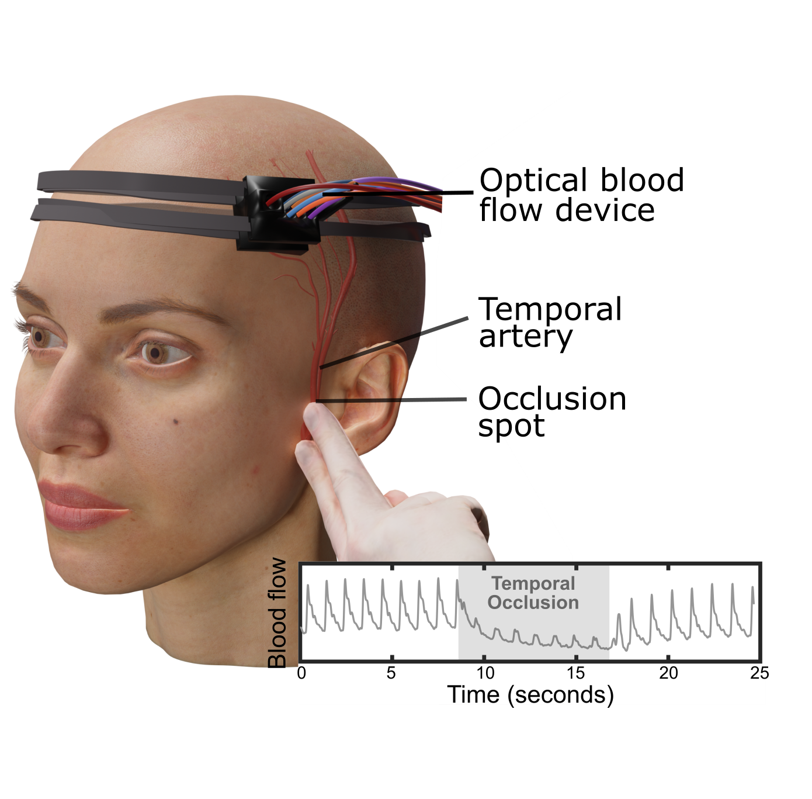
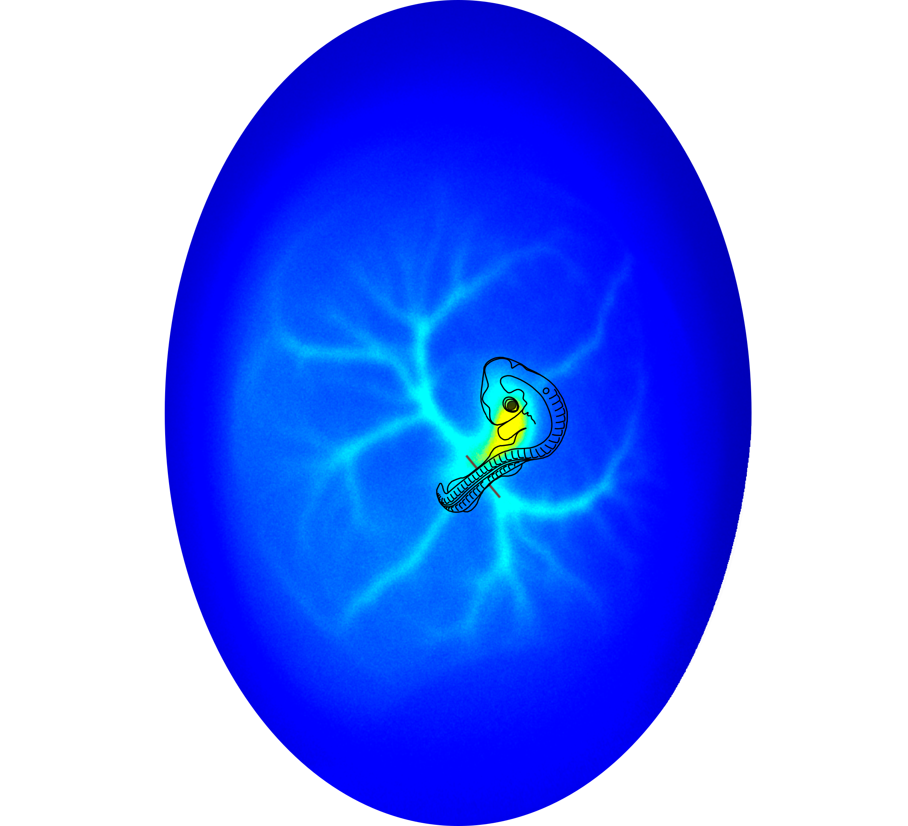


 
You can also find my articles on <a href="{{site.author.googlescholar}}" target="_blank">my Google Scholar profile</a>.


## List of Publications 
#### Sorted from most recent to oldest
 28 – <b>Exploring Non-Invasive Sexing of Chicken Eggs at the Early Embryonic Stage Using Laser Speckle Contrast Imaging and Deep Neural Networks.</b>   S. Mahler,  Z. Dong, C. Redhead, M. Bronner, C. Yang.     Under review (2024).    

  27 – <b>Assessing Scalp and Brain Sensitivity in Blood Flow Measurements via Occlusion of the Temporal Artery.</b>   Y. X. Huang*, S. Mahler,  M. Dickson, A. Abedi, J. M. Tyszka, J. L. Y. Tung, J. Russin, C. Liu, C. Yang.    arXiv:2501.19005 Under review (2024). <a href="https://doi.org/10.48550/arXiv.2501.19005" target="_blank">(article link)</a>    

  26 – <b>Portable Six-Channel Laser 
Speckle System for Cerebral Blood Flow and Volume Measurements with Potential Application in Traumatic Brain Injury Detection.</b>  S. Mahler,  Y. X. Huang, M. Ismagilov, D.A. Chou, A. Abedi, J. M. Tyszka, J. L. Y. Tung, J. Russin, C. Liu, C. Yang.    Neurophotonics 12(1), 015003 (2025). <a href="https://doi.org/10.1117/1.NPh.12.1.015003" target="_blank">(article link)</a>    

  25 – <b>Automated Non-Invasive Laser 
Speckle Imaging of the Chick Heart Rate and Extraembryonic Blood Vessels and Their Response to Nifedipine and Amlodipine Drugs.</b>    C. Redhead*, S. Mahler*,  Z. Dong, X. Chen, C. Yang, M. E. Bronner.    Developmental Biology 519, 46-54 (2025). <a href="https://doi.org/10.1016/j.ydbio.2024.12.005" target="_blank">(article link)</a>    

  24 – <b>Roadmap on Structured Light Lasers.</b>    Q. Liu, X. Fu, Z. Zhang, A. Forbes, N. Davidson, S. Mahler,  A. Friesem et al.    Under peer-review, Journal of Optics (2024).    

  23 – <b>[Editors' Pick + News Release] Correlating Stroke Risk with Non-Invasive Cerebrovascular Perfusion Dynamics Using a Portable Speckle Contrast Optical Spectroscopy Laser Device.</b>   Y. X. Huang*,S. Mahler*,  A. Abedi, J. M. Tyszka, J. L. Y. Tung, P. Lyden, J. Russin, C. Liu, C. Yang.  Biomedical Optics Express 15, 6083-6097 (2024). <a href="https://doi.org/10.1364/BOE.534796" target="_blank">(article link)</a>   

  22 – <b>[Editors' Pick – Journal Cover] Non-Invasive Laser Speckle Contrast Imaging (LSCI) of Extra-Embryonic Blood Vessels in Intact Avian Eggs at Early Developmental Stages.</b>   Z. Dong*, S. Mahler*,  C. Redhead, X. Chen, M. Dickson, M. Bronner, C. Yang.    Biomedical Optics Express 15(8), 4605-4624 (2024). <a href="https://doi.org/10.1364/BOE.530366" target="_blank">(article link)</a>    

  21 – <b>Compact and Cost-Effective Laser-Powered Speckle Contrast Optical Spectroscopy Fiber-Free Device for Measuring Cerebral Blood Flow.</b>    Y. X. Huang*, S. Mahler*,  M. Dickson, A. Abedi, J. M. Tyszka, J. L. Y. Tung, J. Russin, C. Liu, C. Yang.    Journal of Biomedical Optics 29(6), 067001 (2024). <a href="https://doi.org/10.1117/1.jbo.29.6.067001" target="_blank">(article link)</a>    

  20 – <b>AI-Guided Histopathology Predicts Brain Metastasis in Lung Cancer Patients.</b>    H. Zhou, M. Watson, C. T. Bernadt, S. S. Lin, C. Lin, J. H. Ritter, A. Wein, S. Mahler,  S. Rawal, R. Govindan, C. Yang, R. Cote.    Journal of Pathology 263, 89-98 (2023). <a href="https://doi.org/10.1002/path.6263" target="_blank">(article link)</a>    

  19 – <b>[Editors' Pick] Assessing 
Depth Sensitivity in Laser Interferometry Speckle Visibility Spectroscopy (iSVS) Through Source-to-Detector Distance Variation and Cerebral Blood Flow Monitoring in Humans and Rabbits.</b>   S. Mahler,  Y. X. Huang, M. Liang, A. Avalos, J. M. Tyszka, J. Mertz, C. Yang.    Biomedical Optics Express 14, 4964-4978 (2023). <a href="https://doi.org/10.1364/BOE.498815" target="_blank">(article link)</a>    

  18 – <b>Interferometric Speckle Visibility Spectroscopy (iSVS) for Measuring Decorrelation Time and Dynamics of Moving Samples with Enhanced Signal-to-Noise Ratio and Relaxed Reference Requirements.</b>    Y. X. Huang, S. Mahler,  J. Mertz, C. Yang.    Optics Express 31(19), 31253-31266 (2023). <a href="https://doi.org/10.1364/OE.499473" target="_blank">(article link)</a>    

17 – S. Mahler, M. A. Rmilah, A. A. Friesem, N. Davidson. Percolation with coupled lasers: effect of non-linearities on the phase transition. Under preparation, (2024).

16 – S. Mahler*, E. Bernstein*, S. Gadasi, G. Arwas, A. A. Friesem, N. Davidson. Programmable all optical spin simulator with artificial gauge fields. Second round of peer-review, Physical Review Letters (2024). <a href="https://arxiv.org/abs/2408.13865" target="_blank">(article link)</a>

15 – N. Davidson, S. Mahler, A. A. Friesem, A. Forbes. Complex-Light Lasers. Optics and Photonics News May 2022, 26-33 (2022). <a href="https://doi.org/10.1364/OPN.33.5.000026" target="_blank">(article link)</a>

14 – [Editors' Suggestion] Y. Eliezer*, S. Mahler*, A. A. Friesem, H. Cao, N. Davidson. Controlling Nonlinear Interaction in a Many-Mode Laser by Tuning Disorder. Physical Review Letters 128, 143901 (2022). <a href="https://doi.org/10.1103/PhysRevLett.128.143901" target="_blank">(article link)</a>

13 – R. Chriki, S. Mahler, C. Tradonsky, A. A. Friesem, N. Davidson. Real-time full-field imaging through scattering media by all-optical feedback. Physical Review A 105, 033527 (2022). <a href="https://doi.org/10.1103/PhysRevA.105.033527" target="_blank">(article link)</a>

12 – A. N. K. Reddy*, S. Mahler*, A. Goldring, V. Pal, A. A. Friesem, N. Davidson. Phase locking of lasers with Gaussian coupling. Optics Express 30, 1114-1129 (2022). <a href="https://doi.org/10.1364/OE.439957" target="_blank">(article link)</a>

11 – M. Piccardo, V. Ginis, A. Forbes, S. Mahler, A. A. Friesem, N. Davidson et al. Roadmap on multimode light shaping. Journal of Optics 24, 013001 (2021). <a href="https://doi.org/10.1088/2040-8986/ac3a9d" target="_blank">(article link)</a>

10 – C. Tradonsky, S. Mahler, V. Pal, A. A. Friesem, N. Davidson. High-Resolution, Digitally Controlled Multimode Laser. Optics and Photonics News 034, Optics in 2021 (2021). <a href="https://www.optica-opn.org/home/articles/volume_32/december_2021/extras/high-resolution_digitally_controlled_multimode_las/" target="_blank">(article link)</a>

9 – C. Tradonsky, S. Mahler, G. Cai, V. Pal, R. Chriki, A. A. Friesem, N. Davidson. High-resolution digital spatial control of a highly multimode laser. Optica 8(6), 880-884 (2021). <a href="https://doi.org/10.1364/OPTICA.423140" target="_blank">(article link)</a>

8 – S. Mahler, A. A. Friesem, N. Davidson. Experimental demonstration of crowd synchrony and first-order transition with lasers. Physical Review Research 2(4), 043220 (2020). <a href="https://doi.org/10.1103/PhysRevResearch.2.043220" target="_blank">(article link)</a>

7 – S. Mahler *, Y. Eliezer*, H. Yilmaz, A. A. Friesem, N. Davidson, H. Cao. Fast laser speckle suppression with an intracavity diffuser. Nanophotonics 10(1), 129-136 (2020). <a href="https://doi.org/10.1515/nanoph-2020-0390" target="_blank">(article link)</a>

6 – V. Pal, S. Mahler, C Tradonsky, A. A Friesem, N. Davidson. Rapid fair sampling of the XY spin Hamiltonian with a laser simulator. Physical Review Research 2(3), 033008 (2020). <a href="https://doi.org/10.1103/PhysRevResearch.2.033008" target="_blank">(article link)</a>

5 – [Editors' Suggestion] <b>S.Mahler</b>, M. L. Goh, C. Tradonsky, A. A Friesem, N. Davidson. Improved phase locking of laser arrays with nonlinear coupling. Physical Review Letters 124(13), 133901 (2020).  <a href="https://doi.org/10.1103/PhysRevLett.124.133901" target="_blank">(article link)</a>

4 – <b>S.Mahler</b>, V.Pal, C.Tradonsky, R. Chriki, A. A Friesem, N. Davidson. Dynamics of dissipative topological defects in coupled phase oscillators. Journal of Physics B 52(20), 205401 (2019). <a href="https://doi.org/10.1088/1361-6455/ab3d00" target="_blank">(article link)</a>

3 – <b>S.Mahler</b>, C.Tradonsky, R. Chriki, A. A Friesem, N. Davidson. Coupling of laser arrays with intracavity elements in the far-field OSA Optics Continuum 2(6), 2077-2084 (2019).  <a href="https://doi.org/10.1364/OSAC.2.002077" target="_blank">(article link)</a>

2 – R. Chriki, <b>S.Mahler</b>, C.Tradonsky, V.Pal, A.A Friesem, N. Davidson. Spatiotemporal supermodes: Rapid reduction of spatial coherence in highly multimode lasers. Physical Review A 98(2), 023812 (2018). <a href="https://doi.org/10.1103/PhysRevA.98.023812" target="_blank">(article link)</a>

1 – M. R.Kamsap, C. Champenois, J. Pedregosa-Gutierrez, S. Mahler, M.Houssin, M.Knoop. Experimental demonstration of an efficient number diagnostic for long 1D ion chains. Physical Review A 95(1), 013413 (2017). <a href="https://doi.org/10.1103/PhysRevA.95.013413" target="_blank">(article link)</a>

## Table — Publications per Journal

| Journal                            | Impact   Factor (2024)   | No. of   publications|
| --------                           | ------               | --- |
| Physical Review Letters            | 9.0                  | 2   |
| Optica                             | 8.4                  | 1   |
| Nanophotonics                      | 7.1                  | 1   |
| APL Bioengineering                 | 6.6                  | 1   |
| The Journal of Pathology           | 5.6                  | 1   |
| Neurophotonics                     | 5.3                  | 1   |
| Physical Review A                  | 4.0                  | 3   |
| Physical Review Research           | 3.5                  | 2   |
| Journal of Biomedical Optics       | 3.0                  | 1   |
| Biomedical Optics Express          | 3.0                  | 4   |
| Optics Express                     | 3.2                  | 2   |
| Developmental Biology              | 2.5                  | 1   |
| Journal of Optics                  | 2.1                  | 1   |
| Journal of Physics B               | 1.5                  | 1   |
| Optics Continuum                   | 1.1                  | 1   |

#### Table updated on 26-April-2025

