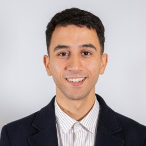
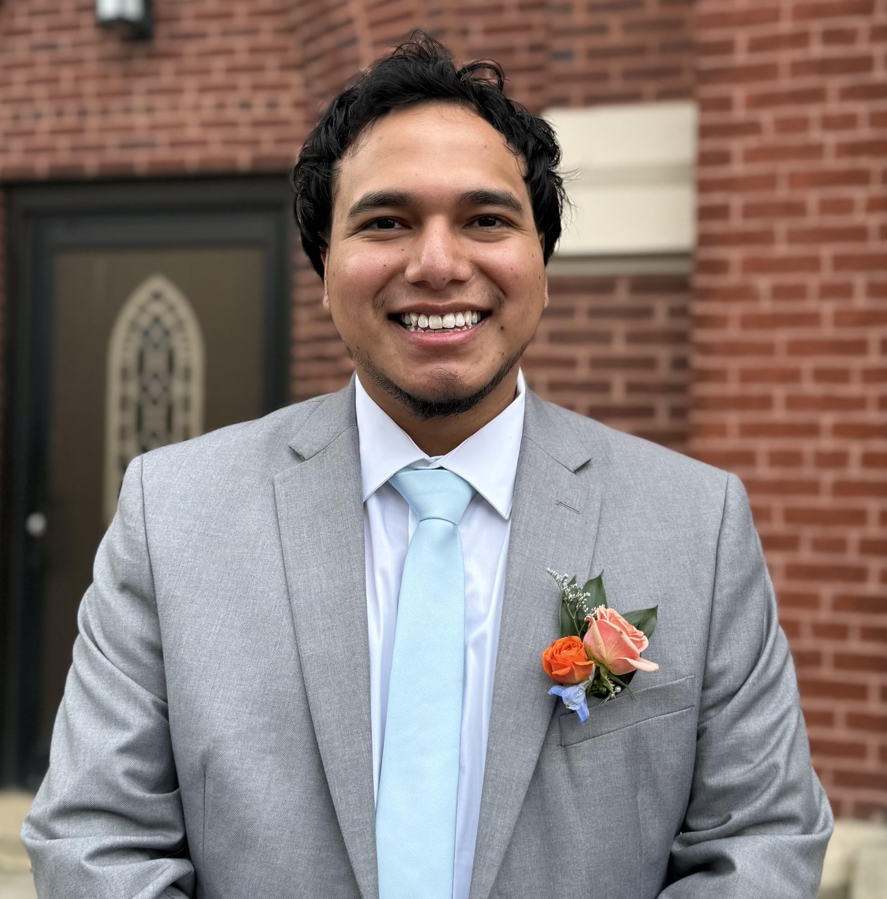
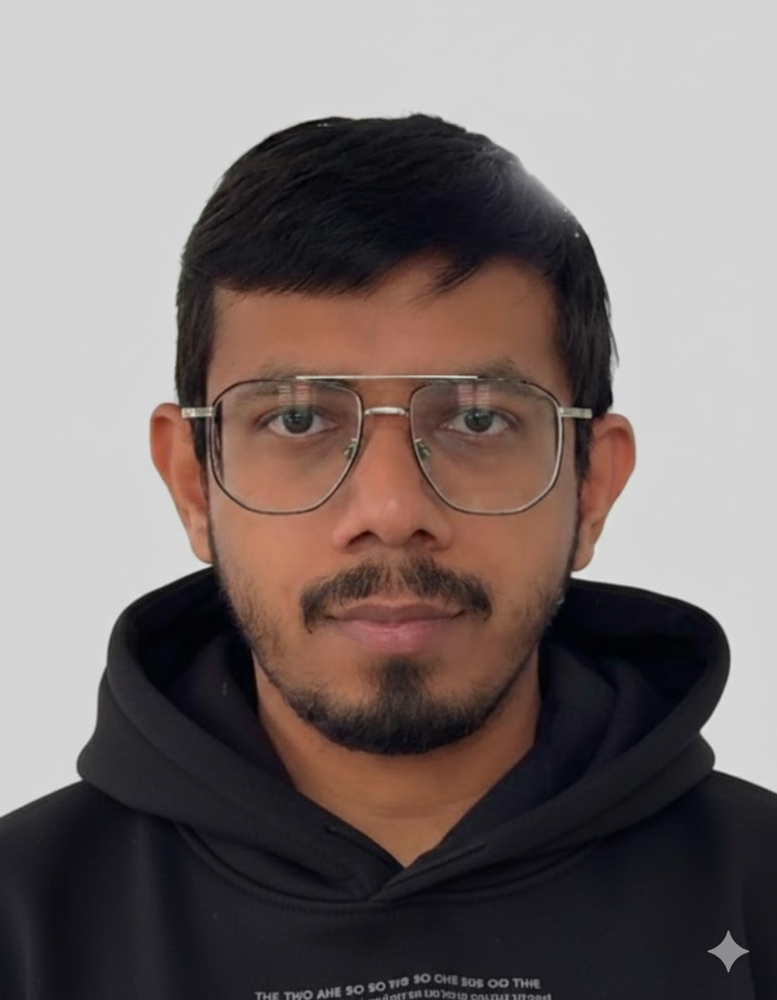
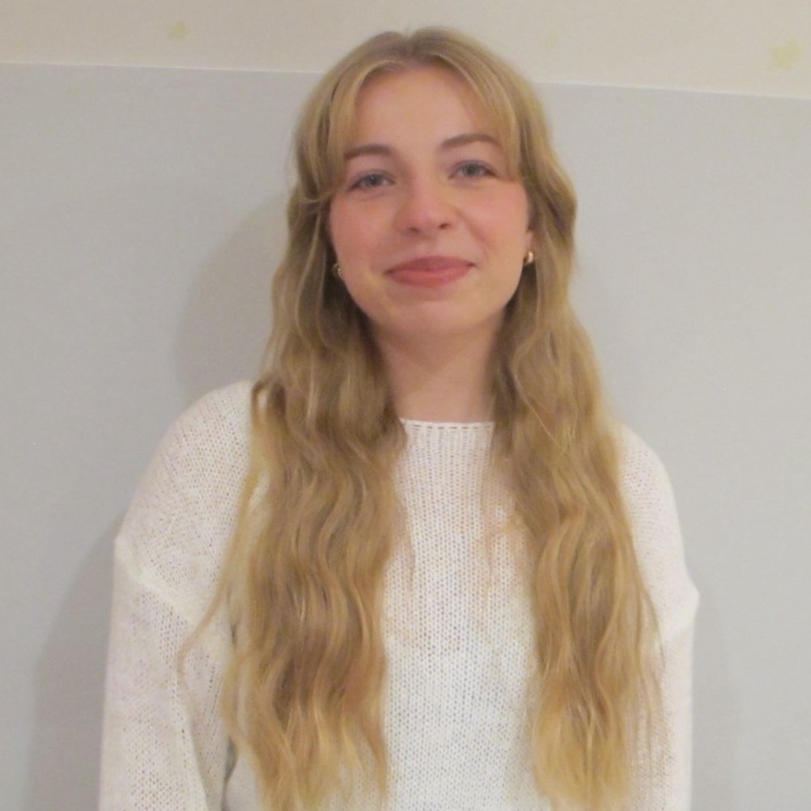
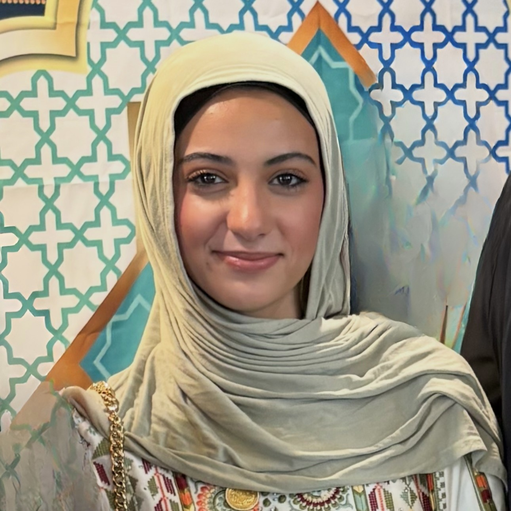
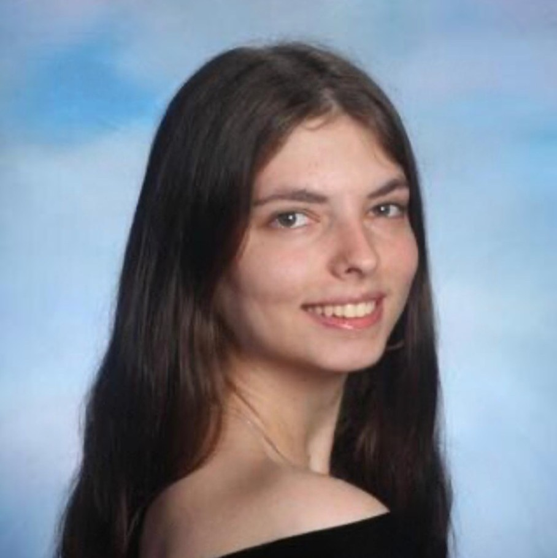
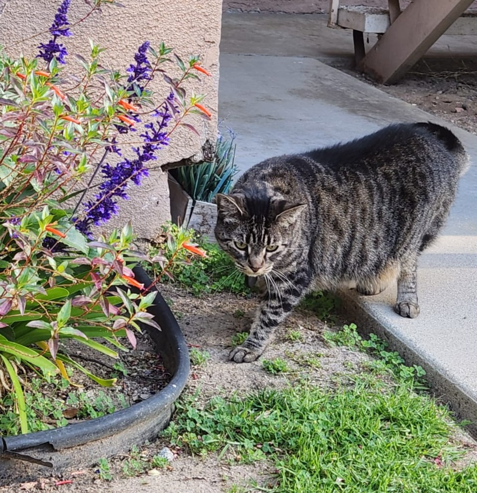
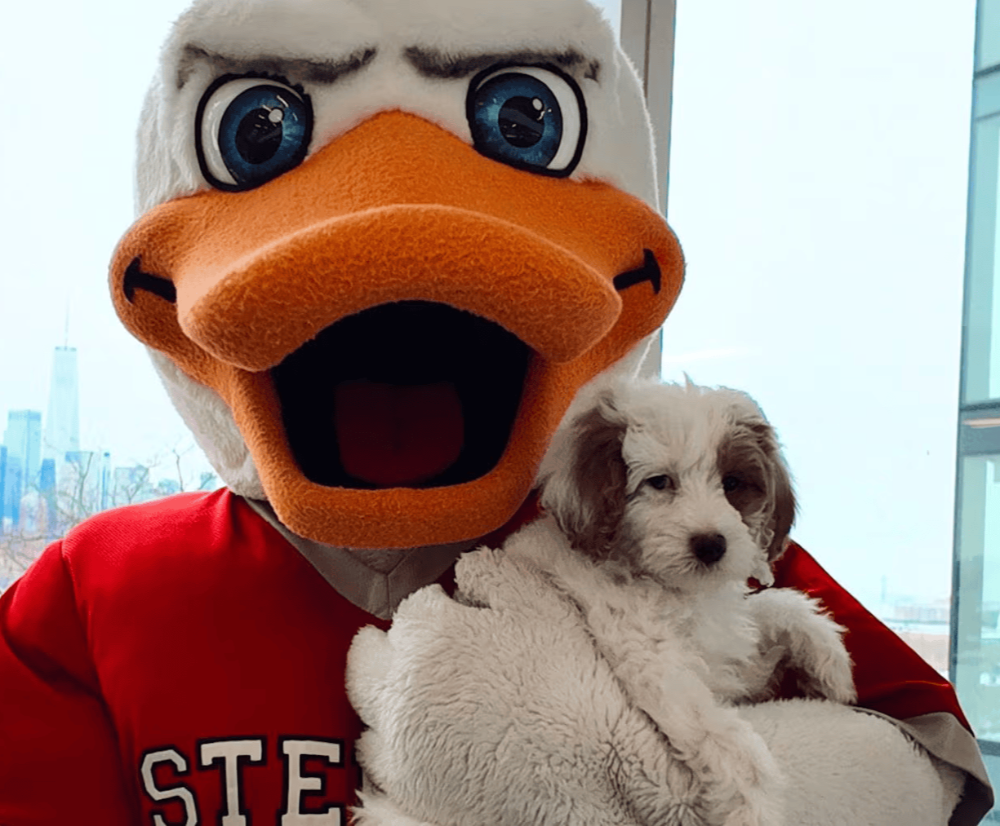

## Principal Investigator
<b>Prof. Simon Mahler </b>
  Assistant Professor 
  Department of Biomedical Engineering 
  Office: McLean Hall, Room 303 
  Email: <a href="mailto:smahler@stevens.edu" target="_blank">smahler@stevens.edu</a>  

## PhD Students

    
  <b>Zijia Jin</b>  
  First-Year PhD Student  
  Labs: McLean Hall 304 & 305 
  Email: <a href="mailto:zjin27@stevens.edu" target="_blank">zjin27@stevens.edu</a>  

<b>Ilyes Lamssalak</b>  
  PhD Student  
  Dual-PhD program with Ecole Centrale de Nantes  
  Labs: McLean Hall 304 & 305 
  Email: <a href="mailto:mfernand1@stevens.edu" target="_blank">mfernand1@stevens.edu</a> 

## Graduate Students
    
  <b>Cesar Noguera</b>  
  MSc Student (BME)  
  Lab: McLean Hall 304 
  Email: <a href="mailto:cnoguera@stevens.edu" target="_blank">cnoguera@stevens.edu</a> 

    
  <b>Sudhanshu Kakkar</b>  
  MSc Student (CS)  
  Graduate Research Assistant 
  Email: <a href="mailto:skakkar@stevens.edu" target="_blank">skakkar@stevens.edu</a>  

## Undergraduate Students
  
    
  <b>Amelia Rojewski</b>  
  Stevens Sophomore (BME)  
  Labs: McLean Hall 305 
  Email: <a href="mailto:arojewsk@stevens.edu" target="_blank">arojewsk@stevens.edu</a> 

    
  <b>Zaina_Matahen</b>  
  Stevens Sophomore (Biology)  
  Labs: McLean Hall 305 
  Email: <a href="mailto:zmatahen@stevens.edu" target="_blank">zmatahen@stevens.edu</a> 
  
    
  <b>Anna Nemenov</b>  
  Stevens Sophomore (Biology)  
  Labs: McLean Hall 305 
  Email: <a href="mailto:anemenov@stevens.edu" target="_blank">anemenov@stevens.edu</a>  

   
## Moral Support 

   
  <b>Nebu Florencio (Nehmo)</b>  
  Never ending PhD     
  
  
  <b>Tillie Stella Stevens</b>  
  <a href="https://www.stevens.edu/news/meet-tillie-stevens-new-campus-pup" target="_blank">The Campus Pup!</a>   
  
<!-- ## Group Picture (Nov-2025)-->

            
