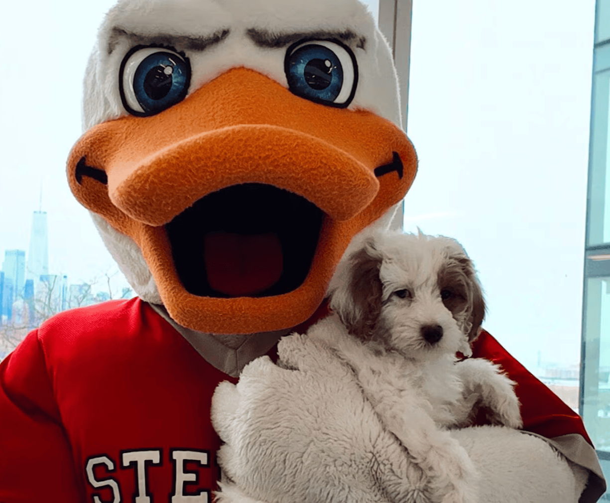
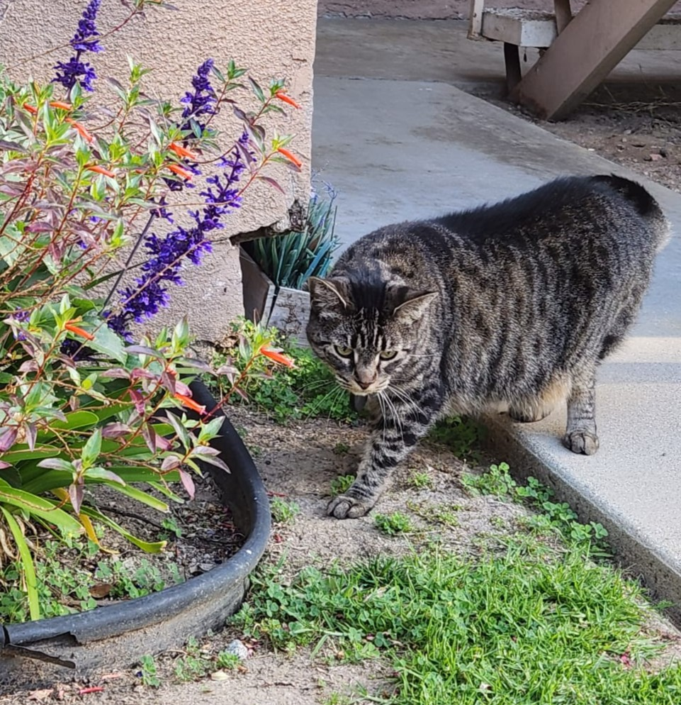

## Principal Investigator
<b>Prof. Simon Mahler </b> 
   Assistant Professor 
  Department of Biomedical Engineering 
  Office: McLean Hall, Room 302 
  Email: <a href="mailto:smahler@stevens.edu" target="_blank">smahler@stevens.edu</a>  

## Graduate Students

<b>Matthew Fernandes</b>  
  First-Year PhD Student  
  Labs: McLean Hall 304 & 305 
   Email: <a href="mailto:mfernand1@stevens.edu" target="_blank">mfernand1@stevens.edu</a>  

    
  <b>Zijia Jin</b>  
  First-Year PhD Student  
  Labs: McLean Hall 304 & 305 
   Email: <a href="mailto:zjin27@stevens.edu" target="_blank">zjin27@stevens.edu</a>  

## Undergraduate Students

   To be determined 

   
## Moral Support 
  
  <b>Tillie Stella Stevens</b>  
  <a href="https://www.stevens.edu/news/meet-tillie-stevens-new-campus-pup" target="_blank">New Campus Pup!</a> 
  Location: walking around campus  
  Instagram page: <a href="https://www.instagram.com/followstevens/?hl=en" target="_blank">here</a>  
  
   
  <b>Nebu Florencio (Nehmo)</b>  
   
