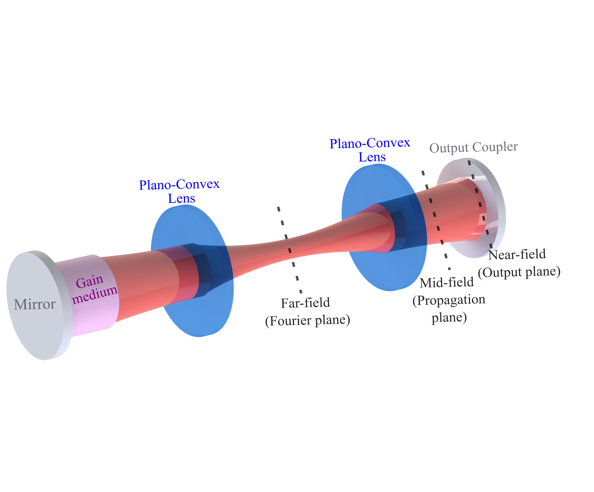


 
You can also find my articles on <a href="{{site.author.googlescholar}}" target="_blank">my Google Scholar profile</a>.


## List of Publications 
#### Sorted from most recent to oldest
 28 – <b>Exploring Non-Invasive Sexing of Chicken Eggs at the Early Embryonic Stage Using Laser Speckle Contrast Imaging and Deep Neural Networks.</b>   S. Mahler,  Z. Dong, C. Redhead, M. Bronner, C. Yang.     bioRXiv:2025.04.17.649355 Under review (2025). <a href="https://www.biorxiv.org/content/10.1101/2025.04.17.649355v1" target="_blank">(article link)</a>    

  27 – <b>Assessing Scalp and Brain Sensitivity in Blood Flow Measurements via Occlusion of the Temporal Artery.</b>   Y. X. Huang*, S. Mahler,  M. Dickson, A. Abedi, J. M. Tyszka, J. L. Y. Tung, J. Russin, C. Liu, C. Yang.    arXiv:2501.19005 Under review (2025). <a href="https://doi.org/10.48550/arXiv.2501.19005" target="_blank">(article link)</a>    

  26 – <b>Portable Six-Channel Laser 
Speckle System for Cerebral Blood Flow and Volume Measurements with Potential Application in Traumatic Brain Injury Detection.</b>  S. Mahler,  Y. X. Huang, M. Ismagilov, D.A. Chou, A. Abedi, J. M. Tyszka, J. L. Y. Tung, J. Russin, C. Liu, C. Yang.    Neurophotonics 12(1), 015003 (2025). <a href="https://doi.org/10.1117/1.NPh.12.1.015003" target="_blank">(article link)</a>    

  25 – <b>Automated Non-Invasive Laser 
Speckle Imaging of the Chick Heart Rate and Extraembryonic Blood Vessels and Their Response to Nifedipine and Amlodipine Drugs.</b>    C. Redhead*, S. Mahler*,  Z. Dong, X. Chen, C. Yang, M. E. Bronner.    Developmental Biology 519, 46-54 (2025). <a href="https://doi.org/10.1016/j.ydbio.2024.12.005" target="_blank">(article link)</a>    

   24 – <b>Roadmap on Structured Light Lasers.</b>    Q. Liu, X. Fu, Z. Zhang, A. Forbes, N. Davidson, S. Mahler,  A. Friesem et al.    Under peer-review, Journal of Optics (2024).    

   23 – <b>[Editors' Pick + News Release] Correlating Stroke Risk with Non-Invasive Cerebrovascular Perfusion Dynamics Using a Portable Speckle Contrast Optical Spectroscopy Laser Device.</b>   Y.X. Huang*,S. Mahler*,  A. Abedi, J.M. Tyszka, J.L.Y. Tung, P. Lyden, J. Russin, C. Liu, C. Yang.    Biomedical Optics Express 15, 6083-6097 (2024). <a href="https://doi.org/10.1364/BOE.534796" target="_blank">(article link)</a>    

  22 – <b>[Editors' Pick – Journal Cover] Non-Invasive Laser Speckle Contrast Imaging (LSCI) of Extra-Embryonic Blood Vessels in Intact Avian Eggs at Early Developmental Stages.</b>   Z. Dong*, S. Mahler*,  C. Redhead, X. Chen, M. Dickson, M. Bronner, C. Yang.  Biomedical Optics Express 15(8), 4605-4624 (2024). <a href="https://doi.org/10.1364/BOE.530366" target="_blank">(article link)</a>    

  21 – <b>Compact and Cost-Effective Laser-Powered Speckle Contrast Optical Spectroscopy Fiber-Free Device for Measuring Cerebral Blood Flow.</b>   Y. X. Huang*, S. Mahler*,  M. Dickson, A. Abedi, J. M. Tyszka, J. L. Y. Tung, J. Russin, C. Liu, C. Yang.    Journal of Biomedical Optics 29(6), 067001 (2024). <a href="https://doi.org/10.1117/1.jbo.29.6.067001" target="_blank">(article link)</a>    

  20 – <b>AI-Guided Histopathology Predicts Brain Metastasis in Lung Cancer Patients.</b>    H. Zhou, M. Watson, C. T. Bernadt, S. S. Lin, C. Lin, J. H. Ritter, A. Wein,  S. Mahler,  S. Rawal, R. Govindan, C. Yang, R. Cote.    Journal of Pathology 263, 89-98 (2023). <a href="https://doi.org/10.1002/path.6263" target="_blank">(article link)</a>    

  19 – <b>[Editors' Pick] Assessing 
Depth Sensitivity in Laser Interferometry Speckle Visibility Spectroscopy (iSVS) Through Source-to-Detector Distance Variation and Cerebral Blood Flow Monitoring in Humans and Rabbits.</b> S. Mahler,  Y.X. Huang, M. Liang, A. Avalos, J.M. Tyszka, J. Mertz, C. Yang.    Biomedical Optics Express 14, 4964-4978 (2023). <a href="https://doi.org/10.1364/BOE.498815" target="_blank">(article link)</a>    

  18 – <b>Interferometric Speckle Visibility Spectroscopy (iSVS) for Measuring Decorrelation Time and Dynamics of Moving Samples with Enhanced Signal-to-Noise Ratio and Relaxed Reference Requirements.</b>    Y. X. Huang, S. Mahler,  J. Mertz, C. Yang.    Optics Express 31(19), 31253-31266 (2023). <a href="https://doi.org/10.1364/OE.499473" target="_blank">(article link)</a>    

